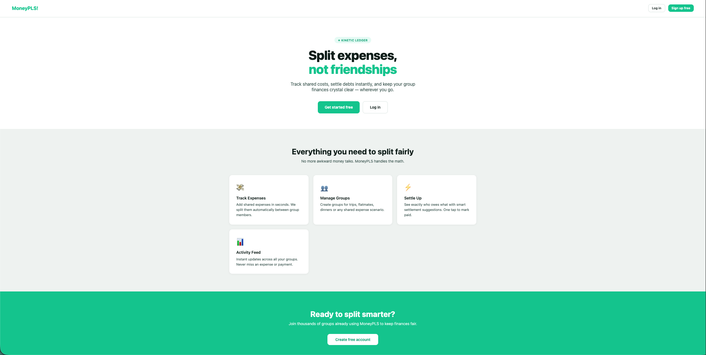
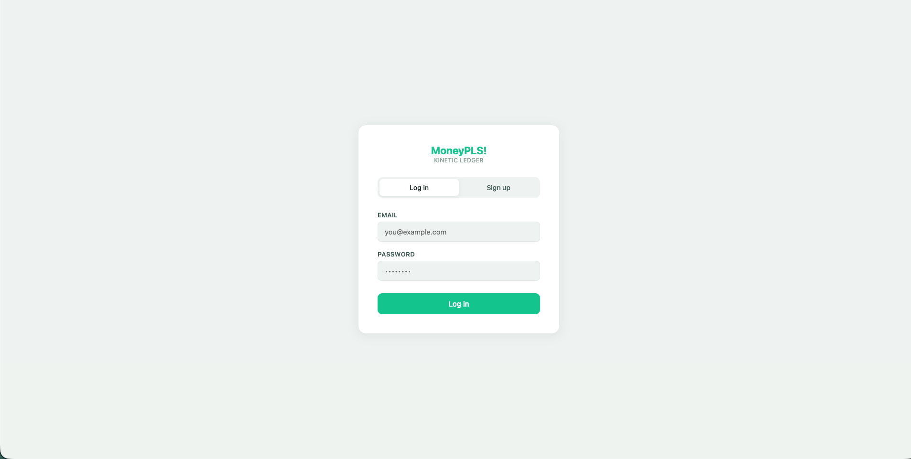
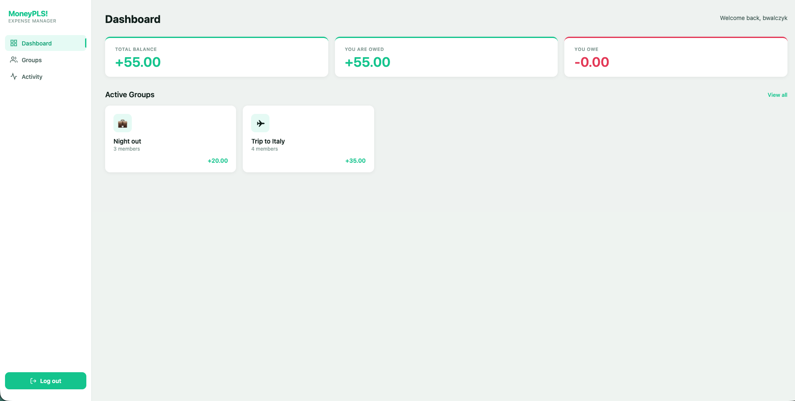
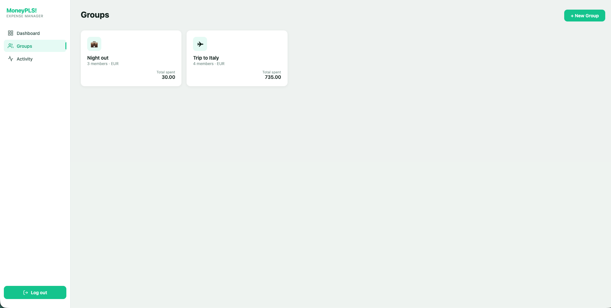
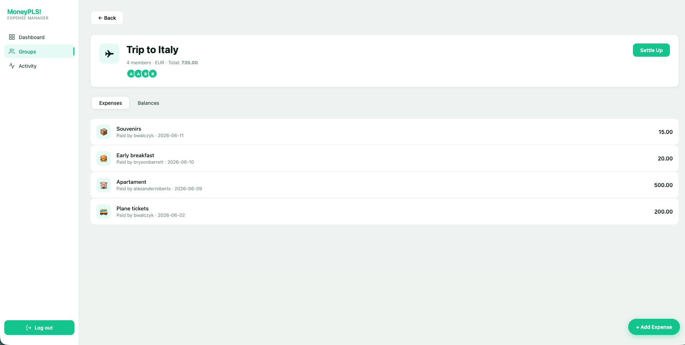
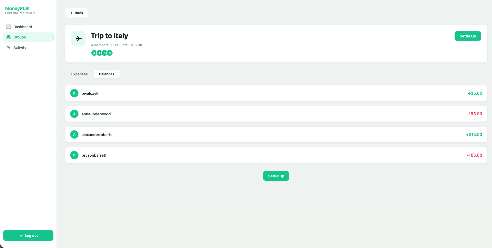
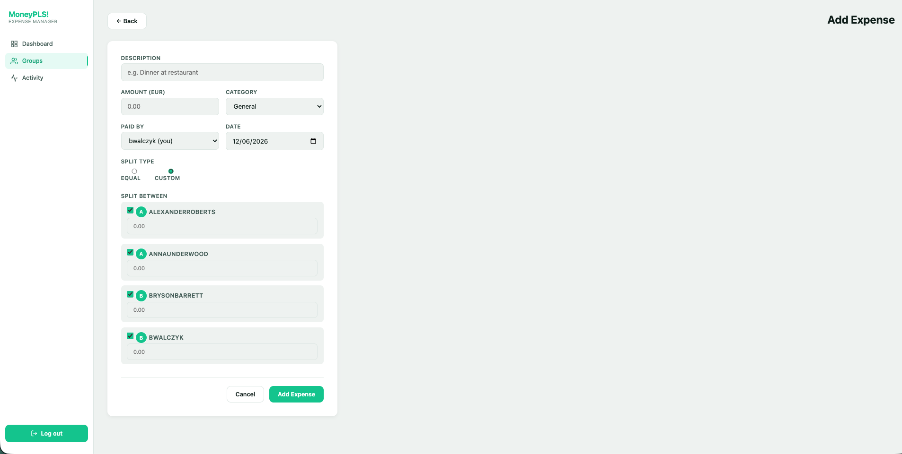
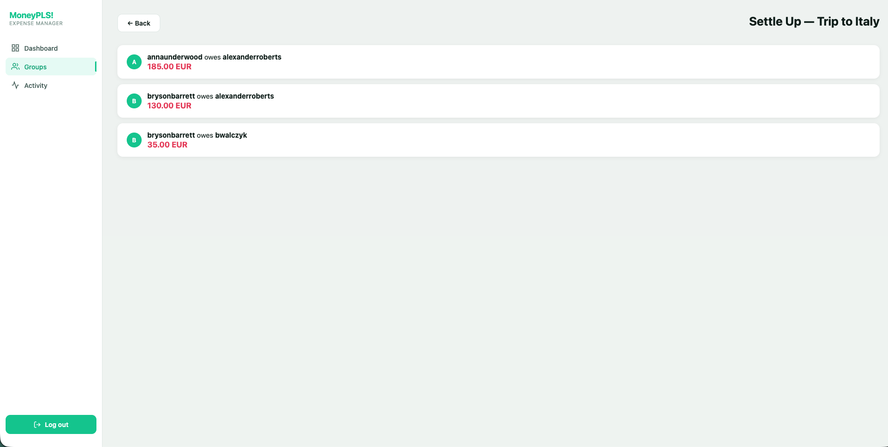
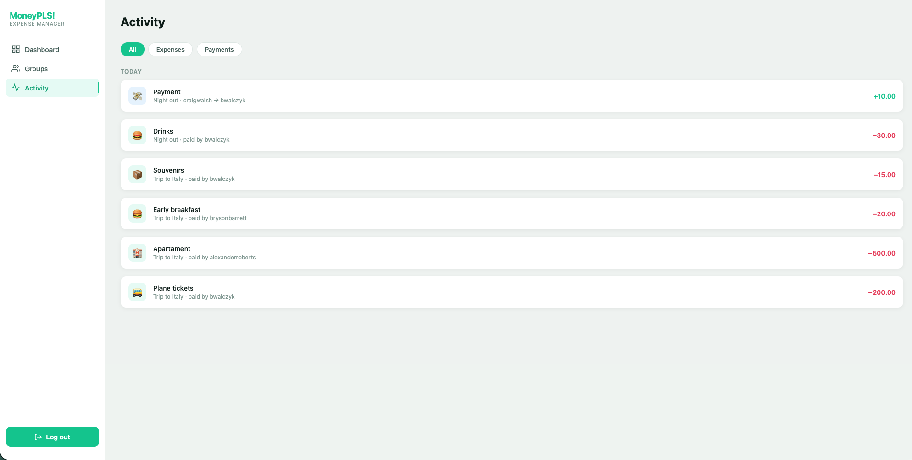
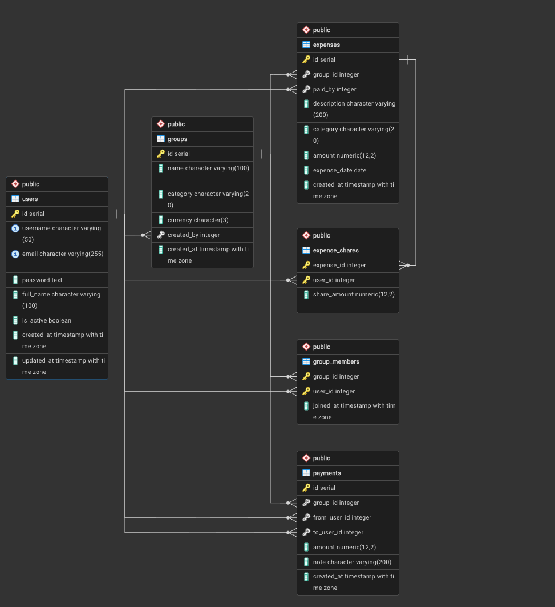

# MoneyPLS — Kinetic Ledger

A Splitwise-style group expense splitting application built with PHP MVC, PostgreSQL and Docker — university project for WdPAI (Introduction to Web Application Programming).

---

## Screenshots

### Landing Page


### Authentication


### Dashboard


### Groups


### Group Detail — Expenses Tab


### Group Detail — Balances Tab


### Add Expense


### Settle Up


### Activity Feed


---

## Features

- **Group expense tracking** — create groups, add members, log shared expenses
- **Flexible cost splitting** — equal split or custom amounts per person
- **Real-time balance calculation** — see exactly who owes whom and how much
- **Settlement suggestions** — greedy algorithm minimizes the number of transactions needed to settle all debts
- **Payment recording** — mark debts as settled, track payment history
- **Activity feed** — unified timeline of all expenses and payments across your groups
- **User search** — live AJAX-powered search when adding members to a group
- **Responsive design** — works on desktop and mobile (sidebar collapses to a top navigation bar)

---

## Tech Stack

| Layer | Technology |
|-------|-----------|
| Language | PHP 8.3 |
| Web server | Nginx |
| Application server | PHP-FPM |
| Database | PostgreSQL 16 |
| Containerization | Docker + Docker Compose |
| Frontend | Vanilla HTML/CSS/JS (no framework) |
| CSS methodology | BEM |

No PHP framework is used — the application implements its own MVC architecture from scratch (custom router, base controller, base model, repository pattern).

---

## Architecture

```
MoneyPLS/
├── index.php                  # Entry point — starts session, runs router
├── Routing.php                # URL router (static + regex dynamic routes)
├── Database.php               # PDO singleton
├── config.php                 # DB credentials
│
├── src/
│   ├── controllers/           # HTTP layer — handle requests, call repos, render views
│   │   ├── AppController.php  # Base: render(), redirect(), requireAuth(), CSRF, h()
│   │   ├── SecurityController.php
│   │   ├── DashboardController.php
│   │   ├── GroupsController.php
│   │   ├── ExpensesController.php
│   │   ├── SettleUpController.php
│   │   ├── ActivityController.php
│   │   └── UsersController.php   # API endpoint for member search
│   │
│   ├── repositories/          # Data access layer — all SQL lives here
│   │   ├── Repository.php     # Base: holds Database instance
│   │   ├── GroupsRepository.php
│   │   ├── ExpensesRepository.php
│   │   ├── PaymentsRepository.php
│   │   ├── UsersRepository.php
│   │   └── BalancesRepository.php  # Balance calculations + settlement suggestions
│   │
│   └── models/                # Domain objects with validation
│       ├── AppModel.php       # Base: validate(), addError(), getErrors()
│       ├── User.php
│       ├── Group.php
│       ├── Expense.php
│       ├── ExpenseShare.php
│       └── Payment.php
│
├── public/
│   ├── views/                 # PHP/HTML templates
│   │   ├── partials/          # head.html, sidebar.html, topbar.html
│   │   ├── landing.html
│   │   ├── auth.html          # Login + Register (tab-switched)
│   │   ├── dashboard.html
│   │   ├── groups.html
│   │   ├── group-form.html
│   │   ├── group-detail.html  # Expenses + Balances tabs
│   │   ├── expense-form.html
│   │   ├── settle-up.html
│   │   ├── activity.html
│   │   └── 404.html
│   ├── styles/
│   │   └── main.css           # Full BEM stylesheet with CSS variables
│   └── scripts/
│       └── search.js          # AJAX member search with debounce
│
└── docker/
    ├── nginx/                 # Nginx config + Dockerfile
    ├── php/                   # PHP-FPM Dockerfile
    └── db/
        ├── Dockerfile
        └── init.sql           # Database schema
```

### Request lifecycle

```
Browser → Nginx → index.php → Routing::run()
       → Controller::action() → Repository → PDO → PostgreSQL
       → Controller::render() → View (PHP template) → HTML → Browser
```

---

## Database Schema

### Tables

| Table | Description |
|-------|-------------|
| `users` | Registered accounts (username, email, bcrypt password) |
| `groups` | Expense groups with category and currency |
| `group_members` | Many-to-many: users ↔ groups |
| `expenses` | Individual expenses paid by one member |
| `expense_shares` | How each expense is split among members |
| `payments` | Recorded debt settlements between members |

### Balance calculation

Net balance for a user in a group:

```
net = (sum of expenses paid by user)
    − (sum of expense shares assigned to user)
    + (sum of payments sent by user)
    − (sum of payments received by user)
```

A positive net means other members owe this user money. Negative means this user owes others.

### ERD



---

## User Flow

```
1. Register / Log in
        │
        ▼
2. Dashboard — see total balance across all groups
        │
        ├── 3a. Create a new group
        │         └── Search & add members
        │
        └── 3b. Open existing group
                  │
                  ├── 4. Expenses tab — list of all group expenses
                  │         └── Add Expense
                  │               ├── Set amount, description, category
                  │               ├── Choose who paid
                  │               └── Split equally or set custom amounts
                  │
                  ├── 5. Balances tab — per-member net balances
                  │
                  └── 6. Settle Up
                            ├── See settlement suggestions (who pays whom)
                            └── Record a payment → clears the debt
```

---

## Running the Application

### Prerequisites

- Docker
- Docker Compose

### Start

```bash
git clone <repo-url>
cd MoneyPLS
docker compose up -d --build
```

The app will be available at **http://localhost:8080**.  
pgAdmin is available at **http://localhost:5050** (admin@example.com / admin).

### First run

On first start, Docker runs `docker/db/init.sql` automatically, creating all tables.

### Stop (keep data)

```bash
docker compose down
```

### Stop and wipe database

```bash
docker compose down -v
```

---

## Security

| Measure | Implementation |
|---------|---------------|
| Password hashing | `password_hash()` with `PASSWORD_BCRYPT` |
| Password requirements | Min. 8 characters, 1 uppercase letter, 1 digit |
| SQL injection | PDO prepared statements throughout — no string concatenation in SQL |
| XSS | All view output wrapped in `h()` = `htmlspecialchars()` |
| CSRF | Token generated per session, verified on every POST (login, register) |
| Session fixation | `session_regenerate_id(true)` on login |
| Session cookies | `HttpOnly`, `SameSite=Lax` |
| HTTP status codes | 400 (validation), 401 (bad credentials), 404 (not found) |
| Authorization | `requireAuth()` on every protected route; `isMember()` check on every group action |
| Minimal data exposure | Queries select only needed columns — password hash never reaches member list views |

---

## API Endpoint

| Method | URL | Description |
|--------|-----|-------------|
| `GET` | `/api/users?search=&limit=10` | Search users by username (used by member search AJAX) |

Requires an active session. Returns JSON array of `{id, username}` objects, excluding the currently logged-in user.
